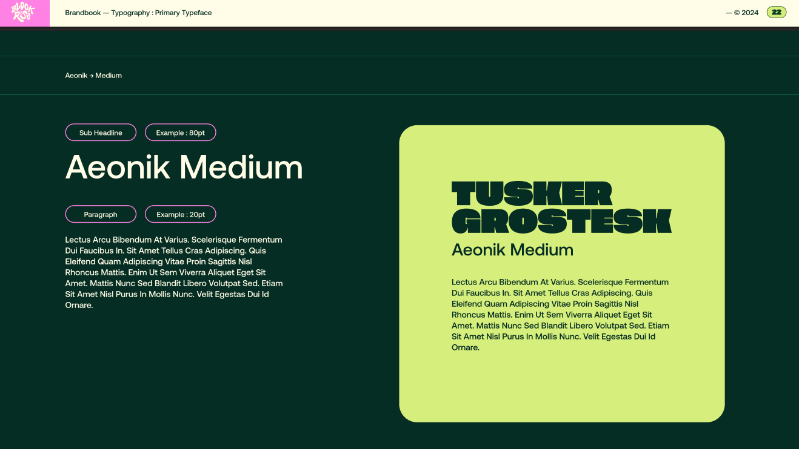
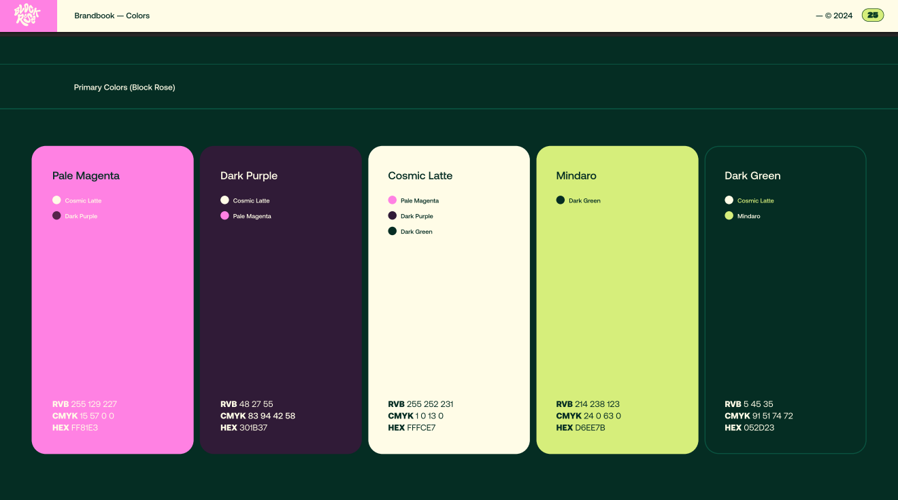
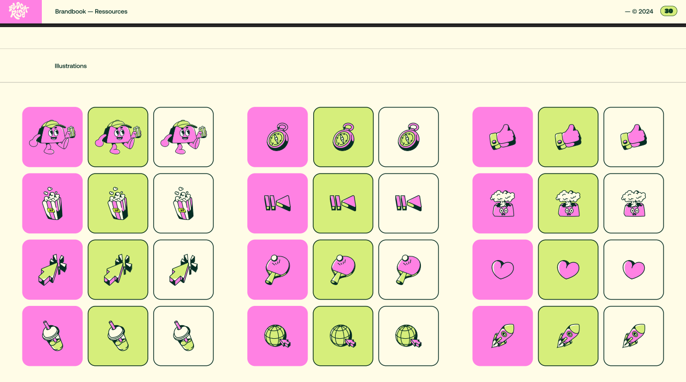
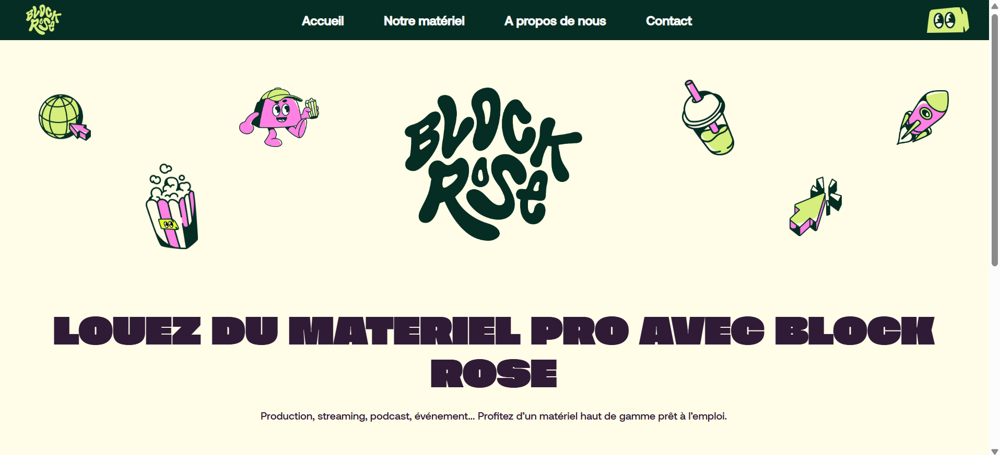
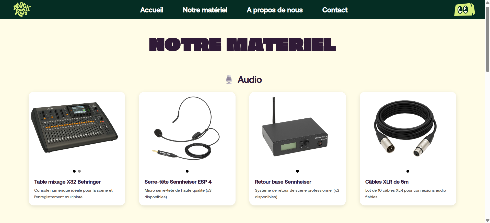
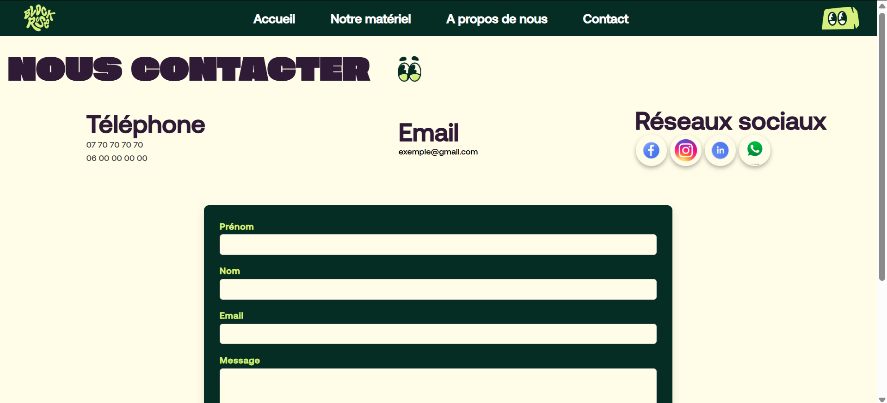

# 🌸 Block Rose – Développement front-end d’un site web

## 📌 Présentation du projet

Block Rose est un projet de **développement front-end** consistant à concevoir l’interface d’un site web de **location de matériel de production**, à partir d’un **brand book et d’un cahier des charges fournis**.

L’objectif principal était de traduire une **identité visuelle existante** en une interface web cohérente, moderne et lisible, tout en respectant des contraintes graphiques précises.

Ce projet a été réalisé en **HTML, CSS et JavaScript vanilla**.

---

## 🧭 Contexte du projet

Le projet s’inscrit dans un cadre collaboratif avec un porteur de projet, qui a fourni :
- un **brand book détaillé** (typographies, couleurs, iconographie)
- des règles graphiques à respecter
- une vision globale du site (positionnement, ambiance, style)

Le développement a été interrompu pour des raisons personnelles indépendantes du projet, mais le code et le travail réalisés constituent une base fonctionnelle et représentative de mon approche front-end.

---

## 📐 Cahier des charges et contraintes

- Respect strict du **brand book**
- Utilisation des **typographies imposées** selon les niveaux de titres
- Palette de couleurs définie
- Choix d’images et d’illustrations conformes aux règles graphiques
- Interface claire et orientée expérience utilisateur
- Développement sans framework (HTML / CSS / JS)

---

## 🎨 Brand book

Quelques extraits du brand book utilisé pour le projet :

  

  

  

Ces éléments ont servi de base pour l’ensemble des choix graphiques et de mise en page.

---

## 🖥️ Aperçu du site

### 🏠 Page d’accueil

  

### 📦 Page catalogue / contenu

  

### 📞 Page contact

  

L’ensemble du site respecte la hiérarchie visuelle définie dans le brand book, avec une attention particulière portée à la lisibilité et à la cohérence graphique.

---

## 🎥 Vidéo de démonstration

Une courte vidéo présentant le site et ses principales sections est disponible ici :

🎥 Démonstration vidéo : https://youtu.be/TUHIGXEr61s

---

## 🛠️ Réalisations techniques

- Intégration front-end en **HTML sémantique**
- Mise en page en **CSS** avec respect des règles graphiques
- Adaptation responsive pour différents formats d’écran
- Ajout d’interactions simples en **JavaScript**
- Organisation claire des fichiers et du code

---

## ⚠️ Difficultés rencontrées

- Traduire un **brand book théorique** en composants web concrets
- Trouver un équilibre entre **créativité** et **respect strict des contraintes**
- Structurer proprement un projet front-end lors d’un **premier projet web**
- Adapter la mise en page pour différents écrans sans framework

---

## 🚀 Ce que ce projet m’a apporté

Ce projet m’a permis de :
- Travailler à partir d’un **cahier des charges réel**
- Comprendre l’importance du **design system et de la cohérence visuelle**
- Développer une approche méthodique du front-end
- Renforcer mon sens du détail et de l’organisation du code

---

## 🧰 Technologies utilisées

- HTML5
- CSS3
- JavaScript (vanilla)

---

## 📍 Statut du projet

Projet arrêté avant finalisation complète pour des raisons personnelles externes.  
Le travail présenté reste représentatif de la démarche, des compétences et de la méthodologie employées.

---

## 👤 Auteur

Projet réalisé par **Romain Ben**  
🔗 LinkedIn : [romainben](https://www.linkedin.com/in/romainben/)
